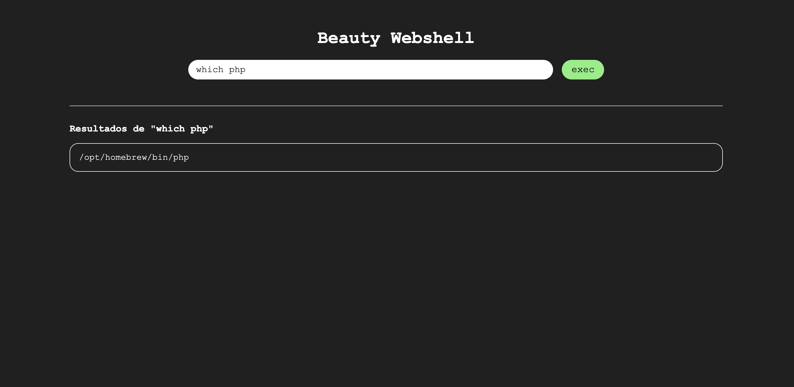

# Beauty Webshell

Pequeño código en PHP que expone una webshell para trabajar de forma más cómoda cuando se logra subir archivos PHP al servidor. El servidor debe poder ejecutar PHP (esto es común cuando nos encontramos servidores Apache).

El script consiste en una interfaz web que realiza peticiones GET con el comando introducido en el campo de entrada. Este código se ejecuta en el servidor mediante la función `system()` y se imprime el resultado en la misma interfaz gráfica.

Como ventajas principales, ofrece una visualización más clara y una interactividad superior, ya que la web por defecto tiene autofoco en la barra de búsqueda y con la tecla ENTER se envía la solicitud, por lo que podemos ejecutar comandos rápidamente.

## Bypass

Es posible que existan filtros que bloqueen archivos `.php`, en estos casos podemos tratar de renombrar el archivo a `bw.php3`, `bw.php4`, `bw.php5`, `bw.php7`, `bw.phtml`, `bw.phps`, `bw.inc`, etc.

También es posible renombrar el archivo como uno compatible, como `.png`, interceptar la petición y cambiarle la extensión por `.php`. Esto funciona solo cunado la validación se realiza solo en el cliente.
